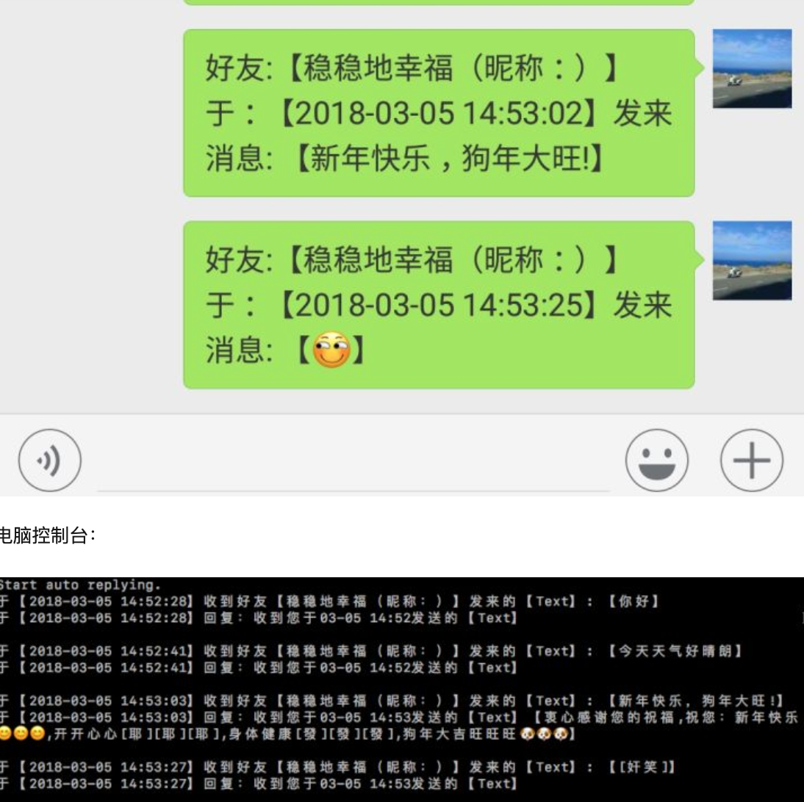
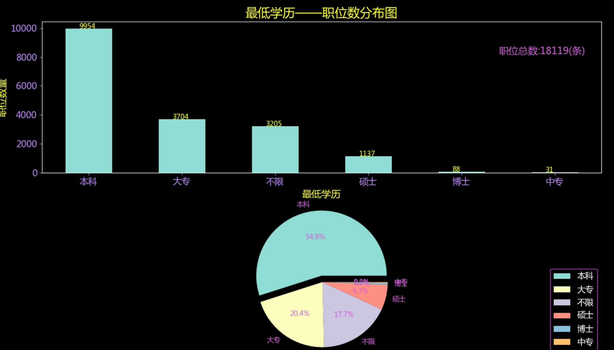
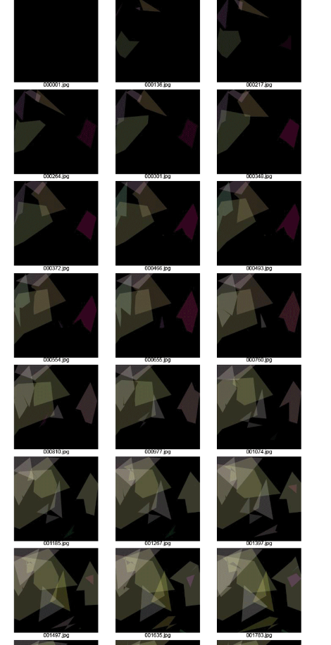
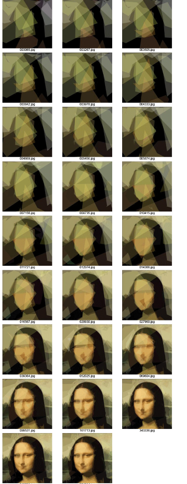
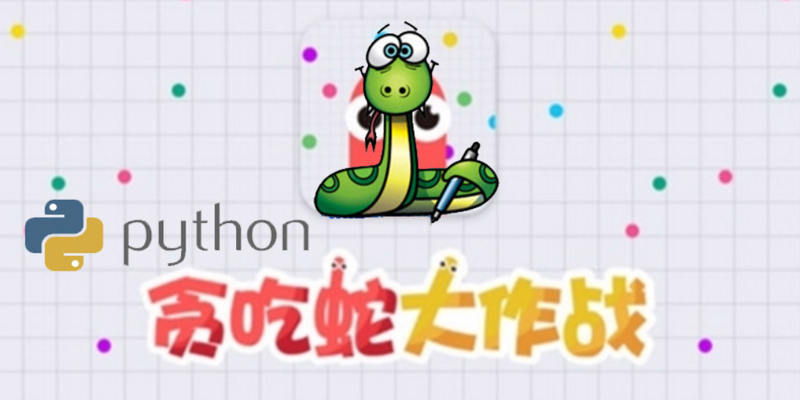
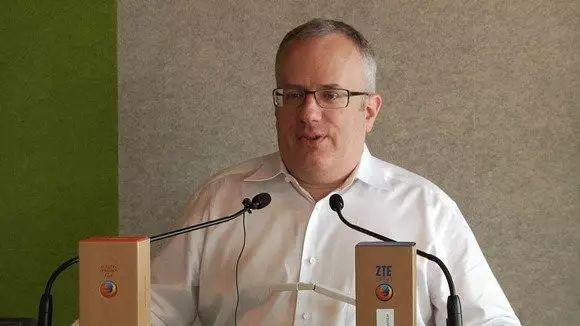

# python介绍

## 简介  

>Python（英国发音：/ˈpaɪθən/“派森” 美国发音：/ˈpaɪθɑːn/“派桑”）是一种应用广泛的解释型，高级编程语言，第一版发布于1991年，Python的设计哲学强调代码的可读性可简洁的语法。Python拥有动态类型系统和垃圾回收功能，能够自动的管理内存使用，并且支持多种编程范式，包括面向对象、命令式、函数式和过程式编程。 

## 趣事  

  

python这个单词的的意思是蟒蛇，logo是两条缠在一起的蟒蛇。

然而，之所以选中Python作为程序的名字，是因为Python的作者是BBC电视剧——蒙提·派森的飞行马戏团的爱好者  

## 应用范围  

python可以用来开发网络应用，比如网站，网络爬虫；gui，进行桌面开发；科学计算，数据分析等。  

Youtube,豆瓣,Instagram,知乎,果壳等网站应用都是python开发的。  

## 有意思的案例

1. 爬取知乎豆瓣漂亮妹子的照片  

      

2. 模仿世界名画风格转化照片  

      

3. [微信自动回复](https://zhuanlan.zhihu.com/p/34238048)  

    

4. [数据分析及可视化](https://zhuanlan.zhihu.com/p/32983898)  

    

5. [遗传算法逐步生产蒙娜丽莎](https://rogerjohansson.blog/2008/12/07/genetic-programming-evolution-of-mona-lisa/)  

      

    

6. [利用树莓派(卡片小电脑)打造墨镜](http://blog.jobbole.com/97180/)  

    

7. [图片转文字制作海报](https://www.shiyanlou.com/courses/370)  

      

8. 家里后院常常遭受松鼠小偷，于是乎他使用Python创造了一套智能武装系统：Kinect定位 -> OpenCV识别松鼠 -> Arduino控制水枪攻击。这是他在PyCon 2012的 Slide（墙外）：https://link.zhihu.com/?target=http%3A//www.slideshare.net/kgrandis/pycon-2012-militarizing-your-backyard-computer-vision-and-the-squirrel-hordes  

9. [换脸](https://www.shiyanlou.com/courses/686)  

    

10. [贪吃蛇游戏](https://zhuanlan.zhihu.com/p/22339492)  

      

## 学习python的最重要的理由---保证发量！！！  

  

众所周知，程序员容易和光头联系在一起，不过深入了解了解那些编程语言之父们头顶的雨林是否茂盛，可以得出一个结论，学习python，头发依然茂盛  

1. java之父James Gosling  

      

2. c语言之父Ken Thompso和Dennis Ritche  

      

3. c++之父 Bjarne Stroustrup  

      

4. php之父Rasmus Lerdorf 

    

5. JavaScript之父 布兰登·艾奇  

      

6. Python之父Guido van Rossum  

    