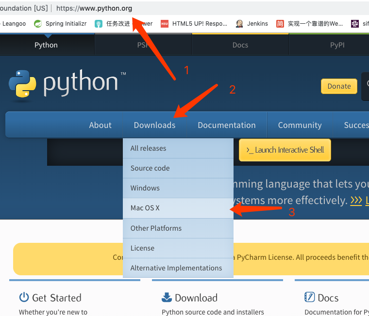

# 安装

## macOS

### homebrew安装

mac系统中自带了pyhton，但是2.7版本。我们学习使用3.6版本，需要安装python 环境。  
打开"终端"，输入`python --version`,显示当前mac系统自带的python版本是2.7.x  

```bash
192:~ apple$ python --version
Python 2.7.10
192:~ apple$ 
```

1. 安装homebrew

    参考[mysql的macOS使用homebrew安装](http://hanzidan.com/sql4pm/%E5%AE%89%E8%A3%85mysql.html)中的第1，2，3步 

2. 安装python

    在终端输入`brew install python3`,等待安装。

3. 检测安装版本  
    在终端中输入`python3 --version`  

    ```bash
    192:~ apple$ python3 --version
    Python 3.7.3
    ```  

### 官网安装

1. 打开[官网链接](https://www.python.org)  

2. 点击"Downloads"->"Mac OS X"  

      

3. 在"Stable Releases"中选择"macOS 64-bit installer"  

      

4. 点击安装，并打开终端输入`python3 --version`进行验证版本