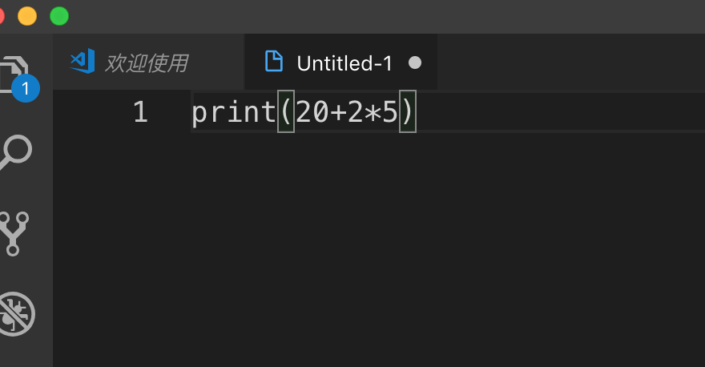
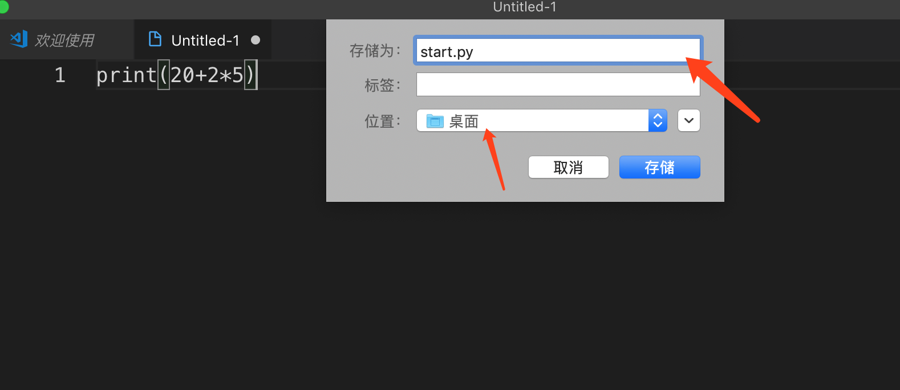

# 快速入门

## 进入Python交互模式

打开“终端”，输入python3,(如果时其他系统，可以输入python,但在mac系统中因为有默认的python2，所以我们用python3来区分使用的版本)光标前面出现`>>>`表示进入了交互模式  

```bash
192:~ apple$ python3
Python 3.7.3 (default, Mar 27 2019, 09:23:15) 
[Clang 10.0.1 (clang-1001.0.46.3)] on darwin
Type "help", "copyright", "credits" or "license" for more information.
>>> 
```  

## hello,world

在交互模式中输入`print("hello,world")`,然后回车，交互模式会展示我们打印的语句。  

```bash
192:~ apple$ python3
Python 3.7.3 (default, Mar 27 2019, 09:23:15) 
[Clang 10.0.1 (clang-1001.0.46.3)] on darwin
Type "help", "copyright", "credits" or "license" for more information.
>>> print("hello,world")
hello,world
>>> 
```

`print()`表示打印输出括号里的内容。在python中输出只有一行，这也是python简单的一个理由，我们可以看看其他语言实现`print("hello,world")`需要的操作:  
java:

```java
class HelloWorld {
    public static void main(String[] args) {
        System.out.println("Hello, world!");
    }
}
```

c#:  

```c#
using System;
class Program
{
    public static void Main(string[] args)
    {
        Console.WriteLine("Hello, world!");
    }
}
```  

Scala:  

```Scala
object HelloWorld extends App {
    println("Hello, world!")
}
```  

go:  

```go
package main
import "fmt"
func main() {
    fmt.Println("Hello, world!")
}
```  

我们看到python只有一行，其他语言一般三到四行左右。  

> hello,world小故事。如同小孩刚出生的啼叫，一个语言当打印输出hello,wolrd，就以为着这个语言有了生命。关于hello,world的开端，最早记载于Brian Kernigham 在 1972 年发布的《 B 语言简介教程(A Tutorial Introduction to the Language B)》中，在那以后，它还被用于1974年的贝尔实验室备忘录，以及1987年的《 C 语言程序设计(The C Programming Language)》，在书中第一个例子就是打印了"hello,world",从此以后,每个语言的第一个例子便是打印出"hello,world".  

## 简单运算

可以在交互模式中运行加减乘除四则运算，在交互模式中输入`20+2*5`,然后回车，下面显示运算的结果"30"  

```bash
192:~ apple$ python3
Python 3.7.3 (default, Mar 27 2019, 09:23:15) 
[Clang 10.0.1 (clang-1001.0.46.3)] on darwin
Type "help", "copyright", "credits" or "license" for more information.
>>> print("hello,world")
hello,world
>>> 20+3*5
35
>>> 
```  

## 退出交互模式  

在交互模式中输入`exit()`,然后回车,可以看到`>>>`消失，进入了命令模式（打开终端时的状态）  

```bash
192:~ apple$ python3
Python 3.7.3 (default, Mar 27 2019, 09:23:15) 
[Clang 10.0.1 (clang-1001.0.46.3)] on darwin
Type "help", "copyright", "credits" or "license" for more information.
>>> print("hello,world")
hello,world
>>> 20+3*5
35
>>> exit()
192:~ apple$ 
```


## 运行py文件

在命令模式下执行`ptyhon3 文件名.py`可以运行文件里的python语句。py后缀是专指python文件，类似.txt,.doc等。

打开vscode->左上角“文件”->"新建文件"，在新建的文件中输入`print(20+2*5)`， 

  

然后点击“文件”->"保存“或”另存为“，文件名可以随意，我们可以设置为`start.py`，位置放在桌面，  




然后打开终端，使用`cd Desktop/`命令回车进入桌面，然后输入`ptyhon3 start.py`回车，我们发现下面数显了30，表示执行了start.py里面的语句。  

```bash
192:~ apple$ cd Desktop/
192:Desktop apple$ python3 start.py
30
192:Desktop apple$ 
```  

## 注释

注释不参与代码运行，主要用来增强程序的可读性，可以将不需要运行的代码注释，或者通过注释来说明这段代码的意义。在python中有两种注释方法： 

1. 单行注释：以#以及空格开头  

    ```Python
    # 这是单行注释
    print(2+2)
    ```  

2. 多行注释：以三个引号开头，三个引号结尾  
    ```Python
    """
    这是多行
    注释
    """
    print(2+2)
    ```  

## 输出

我们上面学过了输出即`print()`函数，可以向屏幕上输出指定的文字，现在我们学习输入函数，可以从键盘等获取输入的信息。python提供了一个函数`input()`可以让用户输入信息，并保存到一个**变量**里。在交互模式输入`name=input()`回车，命令行等待你的输入，此时可以在键盘上任意输入一些文字，然后回车完成输入。  

```bash
>>> name=input()
nihao
>>>
```  


此时，nihao这几个字母就保存在name里，我们可以在交互模式下输入name回车或者print(name)回车，可以看到打印出了nihao。  

```bash
>>> name=input()
nihao
>>> name
'nihao'
>>> print(name)
nihao
>>>
```  

在input的括号里可以填写一些文字给用户一些输入的指示，交互会更好，比如输入`name2=input('请输入你的名字：')`  

```bash
>>> name2=input('请输入你的名字：')
请输入你的名字：nihao
>>> name2
'nihao'
>>>
```


## 小彩蛋

python中内置了一些小彩蛋

1. hello world  
    除了使用print打印外，在python中还有另一种专门打印输出hello world的方式---`import __hello__`。打开终端，输入`python3`进入交互模式，输入`import __hello__`回车。  

    ```bash
    >>> import __hello__
    Hello world!
    >>> 
    ```  

2. python之禅  

    运行`import this`将显示由 Tim Peters 编写的"Zen Of Python（Python 之禅），这是python开发者应该尽力做到的。可以在交互模式下尝试，下面是中文翻译：  

    ```python
    ·优美胜于丑陋。
    ·显式胜于隐式。
    ·简单胜于复杂。
    ·复杂胜于难懂。
    ·扁平胜于嵌套。
    ·分散胜于密集。
    ·可读性应当被重视。
    ·尽管实用性会打败纯粹性，特例也不能凌驾于规则之上。
    ·除非明确地使其沉默，错误永远不应该默默地溜走。
    ·面对不明确的定义，拒绝猜测的诱惑。
    ·用一种方法，最好只有一种方法来做一件事。
    ·虽然一开始这种方法并不是显而易见的，但谁叫你不是 Python 之父呢。
    ·做比不做好，但立马去做有时还不如不做。
    ·如果实现很难说明，那它是个坏想法。
    ·如果实现容易解释，那它有可能是个好想法。
    ·命名空间是个绝妙的想法，让我们多多地使用它们吧！
    ```  

3. 反重力对话  

    在交互模式中输入`import antigravity`,会弹出一个网页里面有副漫画，大体的翻译是： 

    1:你在飞，怎么做到的  
    2:python  

    表示python特别简单
