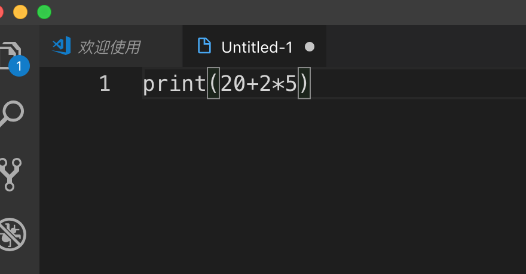

# 浅尝辄止

## 进入Python交互模式

    打开“终端”，输入python3,(如果时其他系统，可以输入python,但在mac系统中因为有默认的python2，所以我们用python3来区分使用的版本)光标前面出现`>>>`表示进入了交互模式  

    ```bash
    192:~ apple$ python3
    Python 3.7.3 (default, Mar 27 2019, 09:23:15) 
    [Clang 10.0.1 (clang-1001.0.46.3)] on darwin
    Type "help", "copyright", "credits" or "license" for more information.
    >>> 
    ```  

## hello,world

    在交互模式中输入`print("hello,world")`,然后回车，交互模式会展示我们打印的语句。  

    ```bash
    192:~ apple$ python3
    Python 3.7.3 (default, Mar 27 2019, 09:23:15) 
    [Clang 10.0.1 (clang-1001.0.46.3)] on darwin
    Type "help", "copyright", "credits" or "license" for more information.
    >>> print("hello,world")
    hello,world
    >>> 
    ```

    `print()`表示打印输出括号里的内容。在python中输出只有一行，这也是python简单的一个理由，我们可以看看其他语言实现`print("hello,world")`需要的操作:  
    java:

    ```java
    class HelloWorld {
        public static void main(String[] args) {
            System.out.println("Hello, world!");
        }
    }
    ```

    c#:  

    ```c#
    using System;
    class Program
    {
        public static void Main(string[] args)
        {
            Console.WriteLine("Hello, world!");
        }
    }
    ```  

    Scala:  

    ```Scala
    object HelloWorld extends App {
        println("Hello, world!")
    }
    ```  

    go:  

    ```go
    package main
    import "fmt"
    func main() {
        fmt.Println("Hello, world!")
    }
    ```  

    我们看到python只有一行，其他语言一般三到四行左右。  

    >hello,world小故事。如同小孩刚出生的啼叫，一个语言当打印输出hello,wolrd，就以为着这个语言有了生命。关于hello,world的开端，最早记载于Brian Kernigham 在 1972 年发布的《 B 语言简介教程(A Tutorial Introduction to the Language B)》中，在那以后，它还被用于1974年的贝尔实验室备忘录，以及1987年的《 C 语言程序设计(The C Programming Language)》，在书中第一个例子就是打印了"hello,world",从此以后,每个语言的第一个例子便是打印出"hello,world".  

## 简单运算

    可以在交互模式中运行加减乘除四则运算，在交互模式中输入`20+2*5`,然后回车，下面显示运算的结果"30"  

    ```bash
    192:~ apple$ python3
    Python 3.7.3 (default, Mar 27 2019, 09:23:15) 
    [Clang 10.0.1 (clang-1001.0.46.3)] on darwin
    Type "help", "copyright", "credits" or "license" for more information.
    >>> print("hello,world")
    hello,world
    >>> 20+3*5
    35
    >>> 
    ```  

## 退出交互模式  

在交互模式中输入`exit()`,然后回车,可以看到`>>>`消失，进入了命令模式（打开终端时的状态）  

```bash
192:~ apple$ python3
Python 3.7.3 (default, Mar 27 2019, 09:23:15) 
[Clang 10.0.1 (clang-1001.0.46.3)] on darwin
Type "help", "copyright", "credits" or "license" for more information.
>>> print("hello,world")
hello,world
>>> 20+3*5
35
>>> exit()
192:~ apple$ 
```


## 运行py文件

在命令模式下执行`ptyhon3 文件名.py`可以运行文件里的python语句。py后缀是专指python文件，类似.txt,.doc等。

打开vscode->左上角“文件”->"新建文件"，在新建的文件中输入`print(20+2*5)`， 

  

然后点击“文件”->"保存“或”另存为“，文件名可以随意，我们可以设置为`start.py`，位置放在桌面，  


然后打开终端，使用`cd Desktop/`命令回车进入桌面，然后输入`ptyhon3 start.py`回车，我们发现下面数显了30，表示执行了start.py里面的语句。  

```bash
192:~ apple$ cd Desktop/
192:Desktop apple$ python3 start.py
30
192:Desktop apple$ 
```